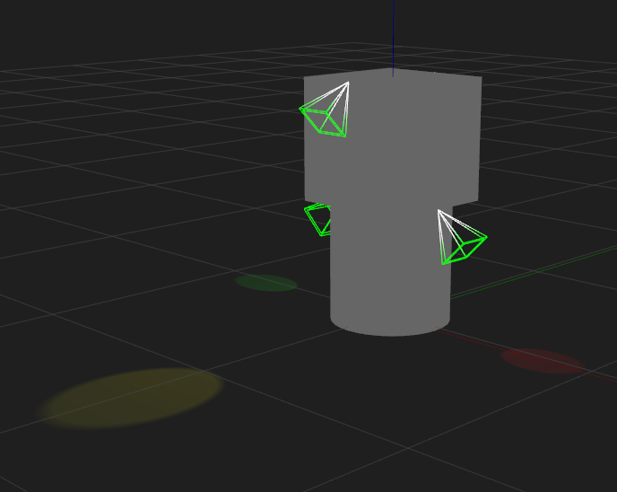
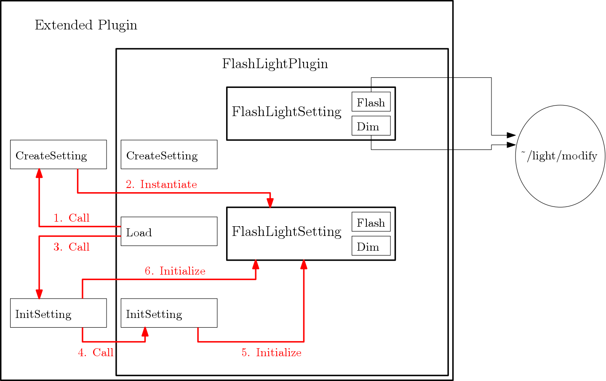

# Flashlight Plugin Introduction



FlashLightPlugin is a [model plugin](/tutorials?tut=plugins_model&cat=write_plugin) included with gazebo that flashes and dims lights on a model. By giving parameters to the plugin, you can choose which lights to blink and also specify the duration and interval time of flashing for each of lights. By inheriting this plugin, you can also use internal features, e.g., dynamically turning the lights on/off.

# Usage and Plugin Parameters
Under `<model>` element, insert <plugin> element with `filename` attribute which is set to `libFlashLightPlugin.so`. In the following example (the world file is available [here](https://bitbucket.org/osrf/gazebo/raw/gazebo9/worlds/flash_light_plugin_demo.world)), the model has two links each of which has two light elements.

```XML
<model name='light_model'>
  <static>1</static>
  <pose frame=''>0 0 0 0 -0 0</pose>
  <link name='cylinder'>

    ...

    <light name='light_source1' type='spot'>

      ...

    </light>
    <light name='light_source2' type='spot'>

      ...

    </light>

    ...

  </link>
  <link name='box'>

    ...

    <light name='light_source3' type='spot'>

      ...

    </light>
    <light name='light_source4' type='spot'>

      ...

    </light>

    ...

  </link>

  ...

  <plugin name='light_control' filename='libFlashLightPlugin.so'>
    <enable>true</enable>
    <flash_light>
      <light_id>cylinder/light_source1</light_id>
      <duration>0.5</duration>
      <interval>0.5</interval>
    </flash_light>
    <flash_light>
      <light_id>cylinder/light_source2</light_id>
      <duration>0.3</duration>
      <interval>1.2</interval>
    </flash_light>
    <flash_light>
      <light_id>box/light_source3</light_id>
      <duration>1.0</duration>
      <interval>0.1</interval>
      <enable>false</enable>
    </flash_light>
    <flash_light>
      <light_id>box/light_source4</light_id>
      <duration>1.0</duration>
      <interval>0.3</interval>
      <enable>true</enable>
    </flash_light>
  </plugin>
</model>
```

The following items are the parameters which the plugin takes.
## `<flash_light>`
This element represents a unit of settings for each flashlight. It can contain the following items. You can place this element as many as the number of light elements which your model has.

## `<light_id>`
This element is required for `<flash_light>`. It specifies which light you are going to control. It is composed of the link name followed by a slash "/" and the light name. In the example, you have a `<light>` named "light_source1" under the `<link>` named "cylinder". So the `<light_id>` should be "cylinder/light_source1".

## `<duration>`
This element is required for `<flash_light>`. It specifies how long time the light must flash in seconds.

## `<interval>`
This element is required for `<flash_light>`. It specifies how long time the light must dim in seconds. If it is set to 0, the light will be static.

## `<enable>`
This element is optional. When it is given under the plugin, it specifies whether all the lights are enabled or not. If it is placed directly under an individual `<flash_light>`, it overrides the global one and affects the corresponding light.

# How Do They Do It?
The diagram below shows an abstract structure of the plugin and its components. `FlashLightPlugin` class holds `FlashLightSetting` objects, each of which holds a unit of settings and maintains the corresponding light element by the Gazebo transport topic.


## FlashLightSetting class
Once the plugin is loaded, it reads the parameters given under the `<plugin>` element. For each `<flash_light>` element, an object of `FlashLightSetting` is created with the given parameters.

To flash/dim the light, `FlashLightSetting` class has two functions: `Flash()` and `Dim()`. It continuously checks the simulation time and finds the right timing to call those functions. Let's say the light to control is now flashing. When the duration time has been passed, it calls `Dim()`. Then, it waits until the interval time is passes. After that, it calls `Flash()`, and repeats these steps above.

## ~/light/modify topic
Gazebo advertises `~/light/modify` topic to update lights in the simulation. `Flash()` and `Dim()` store values in [msgs::Light](https://bitbucket.org/osrf/gazebo/src/gazebo9/gazebo/msgs/light.proto) and send it to this topic so a light appearance reflects to the specified values. Particularly, `Flash()` sets `range` to a non-zero value, and `Dim()` sets it to 0.

# Extension of Plugin
FlashLightPlugin class has member functions which are accessible to inheriting classes. These functions can dynamically turn the flashlights on and off, and can also update the duration and interval time. As the diagram below shows, an extended plugin calls member functions of FLashLightPlugin to control the flashlights. The plugin could let external entities control flashlights by reacting to external events or requests.


## Turning Lights On/Off
An exted plugin can turn on/off a specific flashlight or all the existing lights on the model. If you want to access a particular one, you need to specify the light name and link name as function parameters. If an empty string is given to the link name, the function will access the first match of the light name.

## Changing Duration/Interval
The duration and interval time of flashing can be updated by calling the corresponding functions. The function parameter is the desired time to which the value is set.

# Extension of Setting class
FlashLightSetting class can also be extended. The figure below shows that the plugin now contains inheritances of FlashLightSetting.


## Flash/Dim
By overriding Flash and Dim functions, the inheriting setting class can do its job when the flashlight flashes and dims.

## Instantiation and Initialization
An extended setting class must be instantiated in the process shown in the figure blow. An extend plugin will need to override member functions of FlashLightPlugin.



When a plugin is loaded, CreateSetting function is called to generate a setting object for each flashlight.
```C++
std::shared_ptr<FlashLightSetting>
  FlashLightPlugin::CreateSetting(
    const sdf::ElementPtr &_sdf,
    const physics::ModelPtr &_model,
    const common::Time &_currentTime)
{
  return std::make_shared<FlashLightSetting>(_sdf, _model, _currentTime);
}
```

This function must be overridden by the extended plugin so an object of the extended setting class can be generated.

```C++
std::shared_ptr<FlashLightSetting> ExtendedPlugin::CreateSetting(
  const sdf::ElementPtr &_sdf,
  const physics::ModelPtr &_model,
  const common::Time &_currentTime)
{
  return std::make_shared<ExtendedSetting>(_sdf, _model, _currentTime);
}
```

An object is initialized by InitSettingBySpecificData function. If the object is required to be initialized by data stored in the extended plugin, it must be done in an overridden InitSettingBySpecificData function, where the FlashLightSetting's InitSettingBySpecificData is also called.
```C++
void ExtendedPlugin::InitSettingBySpecificData(
    std::shared_ptr<FlashLightSetting> &_setting)
{
  // Call the function of the parent class.
  FlashLightPlugin::InitSettingBySpecificData(_setting);

  // Do something to initialize the object by the data in the extended plugin.
}
```

## Possible Scenario
This feature will be useful when you want to synchronize other objects with flashing. For example, you can flash and dim visual objects at the same timing of the flashlights.
