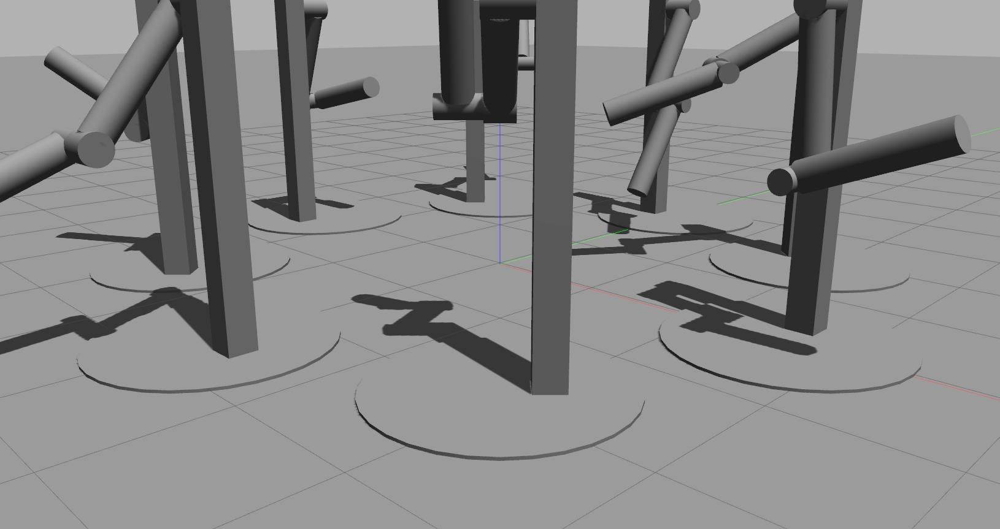
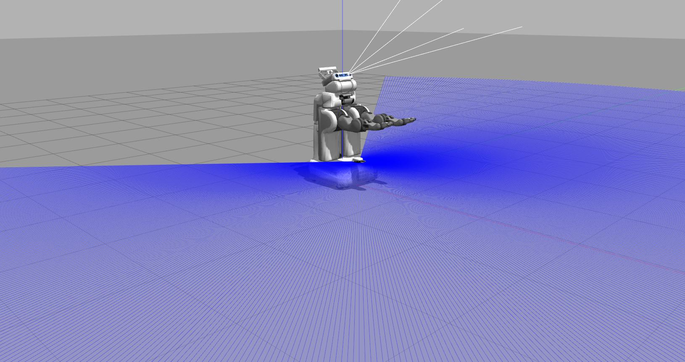
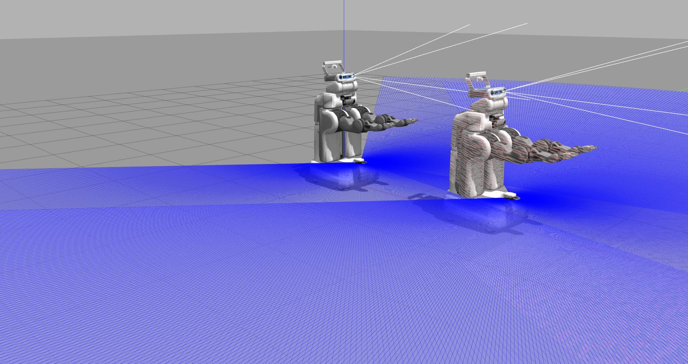
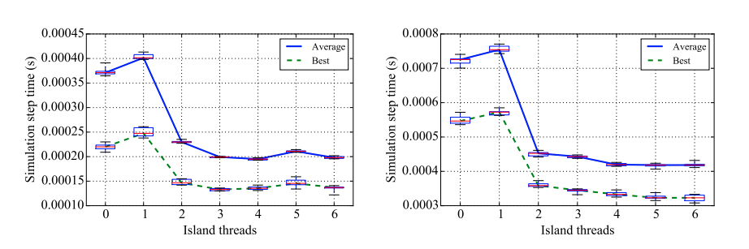

# Overview
The complexity of simulated robots, spatial size of environments, and fidelity of
sensor simulation all play a role in determining what can be simulated with the
constraint of operating at or near real-time. The Gazebo physics update loop is
one of the primary consumers of CPU cycles. With an limitation in the speed of
solution algorithms to solve the underlying mathematical problem that represents
those physical constraints, parallelization of the physics engine is the direction
to go in order to help improve performance, with the goal of running complex robots
and environments in real-time.

# Parallel Strategies
Two strategies to parallelize physics have been implemented: island thread and
position error correction thread. For more details about these two strategies results
and analysis, please refer to the [parallel physics reports on the Gazebo webpage](http://gazebosim.org/assets/parallel_physics-1f40fad62e6878895798c9cb3261d92164a083c2fdbdb18a09d0891fafdc5230.pdf).

Threading is enabled using SDFormat parameters:

* `island_threads`: integer number of threads to use for island threading
* `thread_position_correction`: flag to turn threading on for ODE quickstep position error correction

## Island Thread
The first strategy attempts to parallelize simulation of non-interacting entities.
Simulated entities are interacting if they are connected by an articulated joint (such
as a revolute or universal joint) or are connected via contact. Groups of interacting
entities are clustered into "islands" that are mathematically decoupled from each other.
Thus each island can be simulated in parallel. After each step, the clustering of islands
is recalculated.

## Position Error Correction Thread
The second strategy attempts to speed up the constraint resolution algorithm within
islands for the QuickStep solver. The ODE QuickStep solver is the default solver in
Gazebo and solves constraints posed as a Linear Complementarity Problem (LCP). As an
iterative, fixed time step solver, it is prone to position errors, such as
interpenetration of objects.

In order to correct these errors, an impulse is computed that is applied to the
interpenetrating objects to push them apart. This method of position correction
adds artificial energy into the system. To correct for this additional energy, two
equations are solved. An error correcting LCP is used to correct the object position,
while the velocity is updated without interpenetration error correction. These two
equations can be solved in parallel, due to the independence between each other, two
threads can be used simultaneously to do the computation, which comprises the second
parallelization strategy.

### Examples

The following snippet shows how to configure the physics engine with ode with one island thread and **no** thread position correction.

```xml
<physics type="ode" name="unthrottled1">
  <real_time_update_rate>0.0</real_time_update_rate>
  <ode>
    <solver>
      <thread_position_correction>0</thread_position_correction>
      <island_threads>1</island_threads>
    </solver>
  </ode>
</physics>
```

The following snippet shows how to configure the physics engine with ode with 3 island threads and thread position correction.

```xml
<physics type="ode" name="split_unthrottled3">
  <real_time_update_rate>0.0</real_time_update_rate>
  <ode>
    <solver>
      <thread_position_correction>1</thread_position_correction>
      <island_threads>3</island_threads>
    </solver>
  </ode>
</physics>
```

**NOTES**
 - **The name assigned to the physics tag will allow us to change the physics
 engine in runtime with the command `gz physics -o <name of the physics tag>`
 ( for example: `gz physics -o unthrottled1`)**.
 - **Visit the tutorial [Manage physics profiles](http://gazebosim.org/tutorials?tut=preset_manager&cat=physics)
 for more details about Gazebo physics parameters. These parameters affect the
 performance, accuracy, and general behavior of physics simulation. The
 physics preset manager interface offers a way to easily switch between a set
 of physics parameters and save them to SDF.**

# Running the code

Gazebo is currently instrumented with high-resolution diagnostic timers at several parts of the inner
loop. The timer resolution depends on the hardware in use and is approximately 100ns on our test
machines. To prevent performance degradation during normal usage, the timers are disabled unless the
`ENABLE_DIAGNOSTICS` symbol is defined during compilation. For each simulation step, the elapsed
time is measured and used to compute the following statistics incrementally: mean, minimum,
maximum, and variance of each diagnostic timer. The statistics are computed using the
`math::SignalStats` class. This will output the diagnostic timing data to the `~/.gazebo/diagnostics`
 folder.

```bash
# clone gazebo9
git clone https://github.com/osrf/gazebo -b gazebo9
# or clone gazebo 11
git clone https://github.com/osrf/gazebo -b gazebo11
cd gazebo
mkdir build
cd build
cmake .. -DENABLE_DIAGNOSTICS=1
make
sudo make install
```

**For a detailed version of the install instructions please visit the [install tutorial](http://gazebosim.org/tutorials?tut=install_ubuntu).**

## Test Scenarios

The effectiveness of the parallelization strategies described in this tutorial depends on the scenario that is being simulated. For example, the threaded islands strategy can parallelize simulation of multiple non-interacting robots, while the position error correction strategy can parallelize simulation of individual robot. The following test scenarios
vary the number and complexity of simulated entities to show the performance of each parallelization strategy.

* [revolute\_joint\_test.world](https://github.com/osrf/gazebo/blob/diagnostics_scpeters/test/worlds/revolute_joint_test.world#L12).
The `revolute_joint_test.world` file is used in Gazebo’s automated test system. The world file
includes eight instances of the "double pendulum with base" model arrayed in a circle. The model
consists of a base in contact with the ground that is connected to two links by revolute joints.
The models are arranged in close proximity but do not contact each other. This scenario includes
contact, articulation constraints, and multiple *islands*.


* [pr2.world](https://github.com/osrf/gazebo/blob/diagnostics_scpeters/worlds/pr2.world#L12): The `pr2.world` file includes a PR2 robot on a flat ground plane. There are no other objects with which to interact. The PR2 is a complex robot with 48 rigid bodies and 58 articulation joints. This scenario includes contact and articulation constraints but with only one *island*.


* [dual_pr2.world](https://github.com/osrf/gazebo/blob/diagnostics_scpeters/worlds/dual_pr2.world#L12). The `dual_pr2.world` file includes two PR2 robots on a flat ground plane. The robots do not interact with each other. This scenario is similar to `pr2.world`, but it includes two *islands*, so that the effect of each parallelization strategy can be compared with complex robots.


### Some results: revolute_joint_test.world

The effects of *threaded islands* were measured for the `revolute_joint_test.world` with 0 threads
(control) as well as 1−6 threads. The distribution of average and best-case times for
*ODEPhysics::UpdatePhysics* are shown in the following figure. The clear trend in these two plots is
that using 1 island thread reduces performance by 20-30% relative to the control case of 0 island
threads, while 2 or more threads increase average performance 50% or more. The best-case performance
can be improved by up to 90%, which represents the potential for further performance improvement in
the threading implementation.




The figures above show the average and best-case simulation step time in `revolute_joint_test.world`
without (left) and with (right) threaded position error correction enabled. Both tests are run with
island threading enabled.

### Running some experiments

For a quick review of how parallelization works in Gazebo we will run some experiments. For a deeper review of the experiments please refer to the [Gazebo parallel physics report](http://gazebosim.org/assets/parallel_physics-1f40fad62e6878895798c9cb3261d92164a083c2fdbdb18a09d0891fafdc5230.pdf).

The following results measure the real time factor, this is a simplification
of the tests presented in the [Gazebo parallel physics report](http://gazebosim.org/assets/parallel_physics-1f40fad62e6878895798c9cb3261d92164a083c2fdbdb18a09d0891fafdc5230.pdf) but if
you have installed Gazebo from packages it's another way (less precise) to
check the performance of these parameters. You only can access to the
dianostics tools if you compile Gazebo from sources with the cmake flag
`-DENABLE_DIAGNOSTICS` as explained above.

To run the experiment:

~~~
# to run the revolute joint test
wget https://raw.githubusercontent.com/osrf/gazebo/diagnostics_scpeters/test/worlds/revolute_joint_test.world
gazebo --verbose -o unthrottled0 revolute_joint_test.world

# to run a simulation with a pr2
wget https://raw.githubusercontent.com/osrf/gazebo/diagnostics_scpeters/worlds/pr2.world
gazebo --verbose -o unthrottled0 pr2.world

# to run a simulation with two pr2
https://raw.githubusercontent.com/osrf/gazebo/diagnostics_scpeters/worlds/dual_pr2.world
gazebo --verbose -o unthrottled0 dual\_pr2.world

~~~

Then you can change the physics running in another terminal:

```bash
gz physics -o unthrottled0
# Simulate with island threading:
gz physics -o unthrottled1
# Simulate with island threading:
gz physics -o unthrottled2
...
# Simulate with threaded position error correction:
gz physics -o split_unthrottled0
# Simulate with both types of threading
gz physics -o split_unthrottled1
gz physics -o split_unthrottled2
...
```

#### Other resources

We provide some scripts to run an experiments to track the `real time factor`.

Create a new folder:

```bash
mkdir /tmp/gazebo_parallel
cd /tmp/gazebo_parallel
```

##### Pendulums

```bash
wget https://raw.githubusercontent.com/osrf/gazebo_tutorials/master/parallel/files/run_pendulum_tests.bash
bash run_pendulums_test.bash
```

##### PR2

```bash
wget https://raw.githubusercontent.com/osrf/gazebo_tutorials/master/parallel/files/run_pr2_tests.bash
bash run_pr2_test.bash
```
##### Dual PR2

```bash
wget https://raw.githubusercontent.com/osrf/gazebo_tutorials/master/parallel/files/run_dual_pr2_tests.bash
bash run_dual_pr2_test.bash
```

##### Visualizing the data

To visualize the data you need have installed in your system: Python and these three dependencies (matplotlib, pandas and numpy).

```
pip install -U matplotlib pandas numpy
```

Download the script and visualize the data in the different folders:

```bash
wget https://raw.githubusercontent.com/osrf/gazebo_tutorials/master/parallel/files/show_parallel_results.py
python3 show_parallel_results.py revolute_joint_test/
python3 show_parallel_results.py pr2/
python3 show_parallel_results.py dual_pr2/
```

If you have a look to the results obtained for the pr2. You will see that threaded islands don’t help the single PR2 scenario since the complex PR2
model cannot be partitioned and solved simultaneously over several threads.

Launch the other experiments and try to understand what is happening. Then review the [Gazebo parallel physics report](http://gazebosim.org/assets/parallel_physics-1f40fad62e6878895798c9cb3261d92164a083c2fdbdb18a09d0891fafdc5230.pdf) to compare your thoughts
