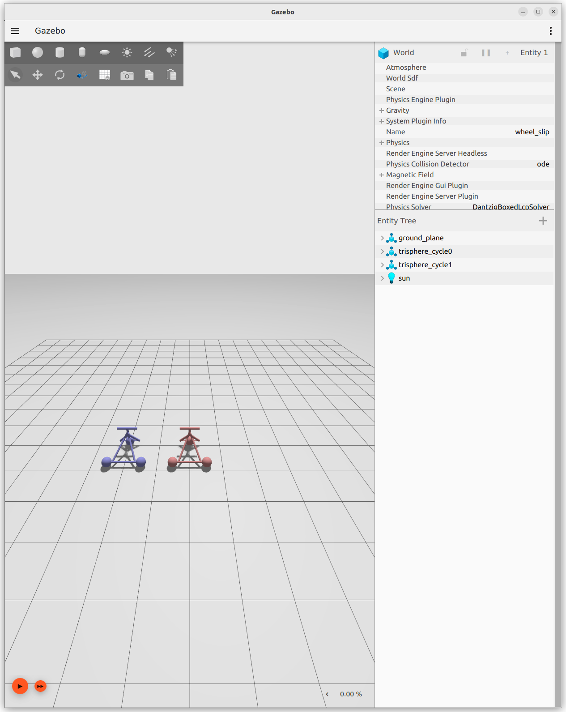

# Getting started with the Parameter interface in Ignition Gazebo

## Introduction

The parameter declaration and manipulation interface to Ignition Gazebo enables more dynamic and configurable simulations. This tutorial explores the motivations behind this feature, outlines the setup process, showcases an example, and demonstrates why this functionality is helpful for simulation applications.

### Motivations

1. **Dynamic Configuration**: Parameters allow for the dynamic configuration of simulation entities without the need to alter the source code or the need to rerun. This is essential for testing various scenarios under different settings.

2. **Consistency with ROS**: Many users of Ignition Gazebo come from a ROS (Robot Operating System) background, where parameter servers are a fundamental feature for storing and manipulating parameters at runtime. This addition makes Ignition Gazebo more intuitive for ROS users.

3. **Enhanced Simulation Control**: With parameters, users can control and adjust simulation aspects on the fly, such as physics properties, sensor configurations, and environmental settings, making simulations more versatile and adaptable.

4. **Simplification of Experiments**: Researchers and developers can easily conduct a range of experiments under varying conditions without the need for multiple SDF files or complex reconfigurations.

### Testing the Parameter Interface

#### Prerequisites

1. Ignition Gazebo built from source (Fortress version or newer)- instructions can be found [here](https://gazebosim.org/docs/fortress/install_ubuntu_src). 


#### Steps

**Launch the Demo World**: Once built, you can launch the `trisphere_cycle_wheel_slip.sdf` demo to see the parameters in action with the following command (please source the gazebo fortress workspace which was built from source before proceeding):

   ```
   ign gazebo trisphere_cycle_wheel_slip.sdf
   ```

After running this command you will see the following window open:


### Utilizing Parameters

With the simulation running, you can interact with the simulation parameters in a separate terminal. Please make sure you source the gazebo fortress workspace which was built from source in the terminal terminal each time before running the commands.

1. **Listing Available Parameters**:

   ```
   ign param -r /world/wheel_slip -l
   ```

   Expected output:

   ```
   systems.wheel_slip.trisphere_cycle1.wheel_front [ignition.msgs.WheelSlipParameters]
   systems.wheel_slip.trisphere_cycle1.wheel_rear_right [ignition.msgs.WheelSlipParameters]
   systems.wheel_slip.trisphere_cycle0.wheel_rear_right [ignition.msgs.WheelSlipParameters]
   systems.wheel_slip.trisphere_cycle1.wheel_rear_left [ignition.msgs.WheelSlipParameters]
   systems.wheel_slip.trisphere_cycle0.wheel_rear_left [ignition.msgs.WheelSlipParameters]
   systems.wheel_slip.trisphere_cycle0.wheel_front [ignition.msgs.WheelSlipParameters]

   ```

   This command lists all parameters available in the `wheel_slip` world, showing their names and types.

2. **Getting a Parameter Value**:

   ```sh
   ign param -r /world/wheel_slip -g -n systems.wheel_slip.trisphere_cycle1.wheel_front
   ```

   Here, we fetch the current values of the `wheel_front` parameter for `trisphere_cycle1`, including `slip_compliance_lateral` and `slip_compliance_longitudinal`.

   Expected output:

   ```
   slip_compliance_lateral: 1
   slip_compliance_longitudinal: 1
   ```

3. **Setting a Parameter Value**:

   ```sh
   ign param -r /world/wheel_slip -s -n systems.wheel_slip.trisphere_cycle1.wheel_front -t ign_msgs.WheelSlipParameters -m
   "slip_compliance_lateral: 1
   slip_compliance_longitudinal: 2"
   ```

   Expected output:

   ```
   Parameter successfully set!
   ```

4. **Get the systems.wheel_slip.trisphere_cycle1.wheel_front parameter again, its value should have changed**:

   ```
   ign param -r /world/wheel_slip -g -n systems.wheel_slip.trisphere_cycle1.wheel_front
   ```

   Expected Output:

   ```
   slip_compliance_lateral: 1
   slip_compliance_longitudinal: 2
   ```

This adjusts the wheel slip parameters, demonstrating the dynamic reconfiguration capabilities provided by the new parameter interface.

### Summary of Features

- Systems can declare parameters using the ignition::gazebo::DeclareParameter() helper function.
- Parameters can be introspected or set from external processes through three services provided by the Parameters system:
  - ```/world/<world_name>/list_parameters service```: List available parameters names and types.
  - ```/world/<world_name>/get_parameter service```: Get the type and value of a parameter.
  - ```/world/<world_name>/set_parameter service```: Set a parameter: parameter name, value, and type need to be provided.
- Parameter types are protobuf messages.
- A ign param command line tool is added. A simple CLI tool to interact with parameters. Though interacting with parameters using ign service is possible, it's not as easy as parameter values are serialized.


### Acknowledgments

This feature was made possible by contributions from the community, particularly Ivan Pauno, who spearheaded the development and integration of the parameters interface into Ignition Gazebo. Details on this change can be found on the [gz-sim repo](https://github.com/gazebosim/gz-sim/pull/1431), [gz-msgs repo](https://github.com/gazebosim/gz-msgs/pull/241), and [gz-transport repo](https://github.com/gazebosim/gz-transport/pull/305).
